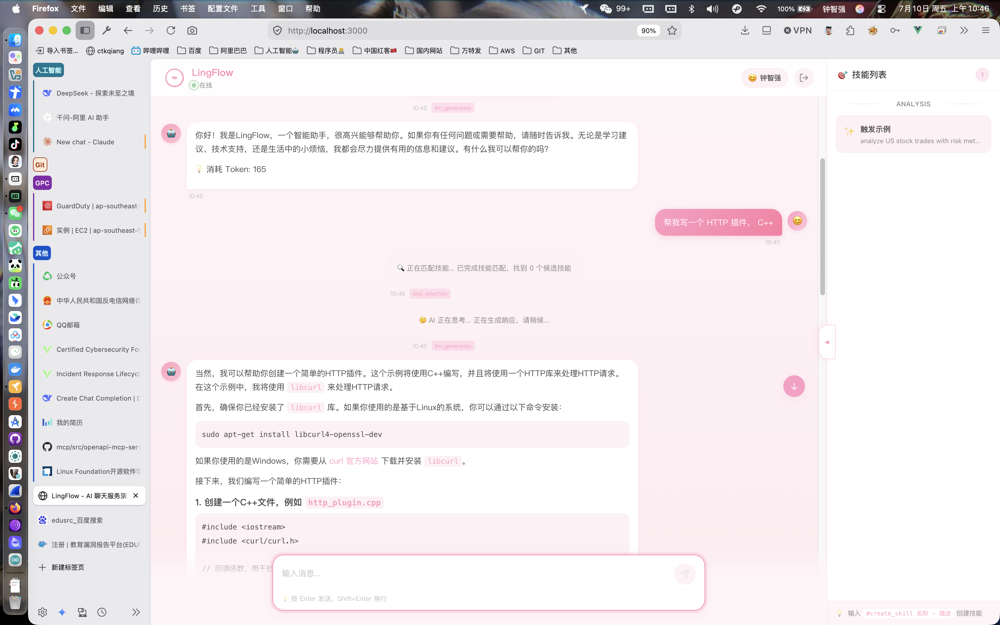
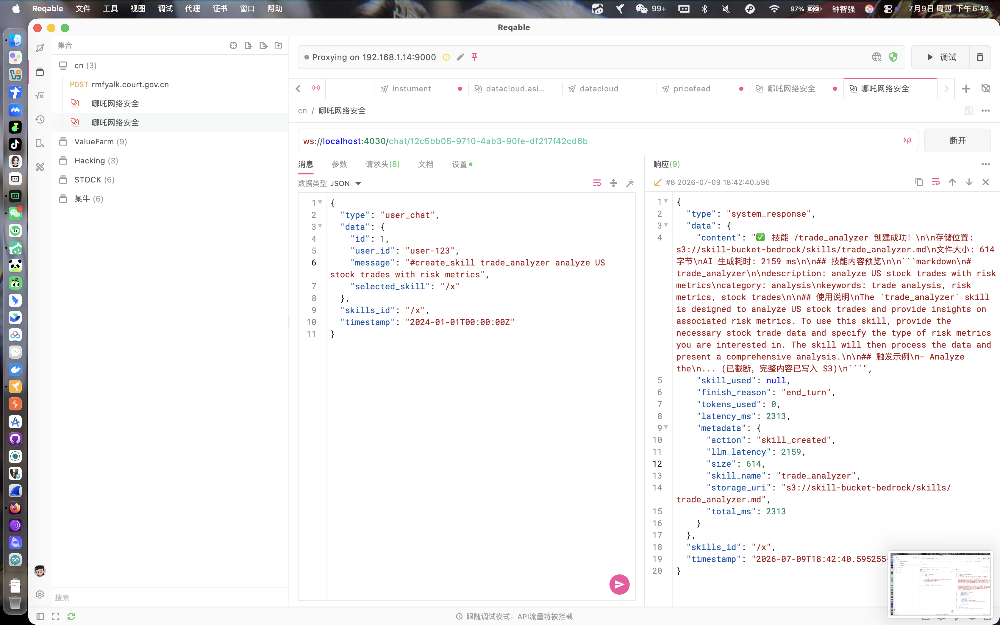
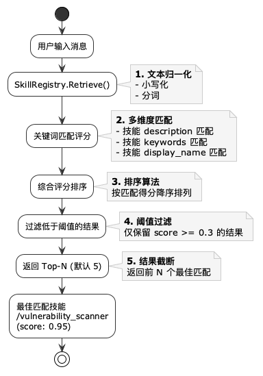
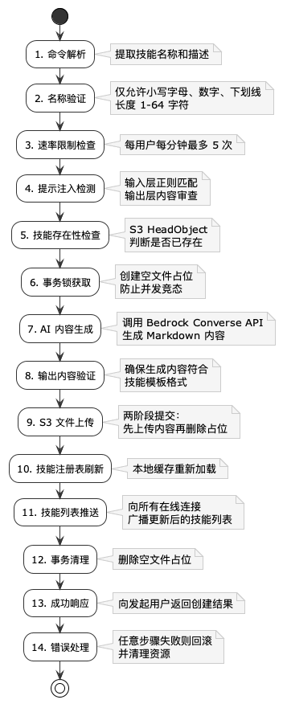

<div align="center">


# LingFlow

### 基于 WebSocket 的 AI 技能驱动聊天服务框架

[](https://go.dev/)
[](https://aws.amazon.com/bedrock/)
[](https://developer.mozilla.org/en-US/docs/Web/API/WebSocket)
[](https://vuejs.org/)
[](https://bun.sh/)
[](LICENSE)
[](CONTRIBUTING.md)

</div>

---

## 目录

- [项目概述](#项目概述)
- [核心特性](#核心特性)
- [系统架构](#系统架构)
- [快速开始](#快速开始)
- [环境配置详解](#环境配置详解)
- [AWS 基础设施准备](#aws-基础设施准备)
- [WebSocket 协议规范](#websocket-协议规范)
- [技能系统](#技能系统)
- [AI 技能创建（#create_skill）](#ai-技能创建create_skill)
- [认证与安全](#认证与安全)
- [事件溯源架构](#事件溯源架构)
- [运行模式](#运行模式)
- [API 参考](#api-参考)
- [测试指南](#测试指南)
- [部署指南](#部署指南)
- [监控与日志](#监控与日志)
- [性能与容量规划](#性能与容量规划)
- [常见问题解答](#常见问题解答)
- [项目结构](#项目结构)
- [演示应用（Vue.js）](#演示应用vuejs)
- [社区与贡献](#社区与贡献)
- [版本历史](#版本历史)

---

## 项目概述

**LingFlow** 是一个基于 **Go 语言**构建的 **WebSocket 实时 AI 聊天服务框架**，核心理念是通过 **S3 动态技能加载** 赋能 LLM（大语言模型），实现可热更新的领域知识注入。系统采用 **事件溯源（Event Sourcing）** 模式管理会话生命周期，支持流式响应（思考过程 + 最终回复），并提供完整的认证、安全防护和多云部署能力。

### 设计哲学

| 原则                | 说明                                                                             |
| ------------------- | -------------------------------------------------------------------------------- |
| **技能即 Markdown** | 技能以 `.md` 文件存储在 S3 中，无需重新编译即可热更新                            |
| **流式透明**        | 客户端实时接收 AI 的思考过程（`system_thinking`）和最终响应（`system_response`） |
| **事件驱动**        | 所有状态变更以不可变事件记录，支持审计和回放                                     |
| **安全优先**        | 内置提示注入检测、速率限制、TLS 强制、Origin 白名单等多层防护                    |
| **多云就绪**        | 支持本地服务器、EC2 和 AWS Lambda + API Gateway 三种部署模式                     |
| **开发者友好**      | 内置 Mock LLM 模式，无需 AWS 凭证即可快速开发测试                                |

### 技术栈

| 层次       | 技术           | 版本         | 说明               |
| ---------- | -------------- | ------------ | ------------------ |
| **后端**   | Go             | 1.26.1       | 高性能服务端语言   |
| **前端**   | Vue.js         | 3.x          | 响应式 UI 框架     |
| **运行时** | Bun            | 1.x          | 前端包管理和运行时 |
| **LLM**    | AWS Bedrock    | Converse API | 大语言模型服务     |
| **存储**   | AWS S3         | -            | 技能文件存储       |
| **通信**   | WebSocket      | RFC 6455     | 实时双向通信       |
| **架构**   | Event Sourcing | -            | 事件溯源模式       |

---

## 核心特性

### 1. WebSocket 流式通信

- 双向实时通信，支持 `system_thinking`（思考过程）和 `system_response`（最终响应）双阶段流式推送
- 应用层心跳机制（Ping/Pong），双向超时检测，自动清理僵尸连接
- 连接建立后服务端主动推送可用技能列表

### 2. S3 动态技能加载

- 技能以 Markdown 文件存储在 AWS S3 中，文件名即为技能标识符
- 服务启动时自动扫描 `skills/` 前缀下所有 `.md` 文件并加载
- 支持运行时通过 `#create_skill` 命令由 AI 自动生成并上传新技能
- 技能更新后无需重启服务，注册中心自动刷新

### 3. AWS Bedrock LLM 集成

- 使用 Bedrock **Converse API**（统一接口），兼容所有 Bedrock 模型
- 支持模型参数配置：Temperature、Top-P、Max Tokens、超时时间
- 内置 Mock LLM 模式，开发阶段无需真实 AWS 凭证即可测试
- 技能上下文自动注入到 System Prompt 中

### 4. 事件溯源（Event Sourcing）

- 会话连接/断开、消息接收/处理/广播、心跳事件全部持久化
- 聚合根（Aggregate Root）封装业务不变量
- 事件存储接口化设计，当前使用内存实现，可无缝替换为数据库

### 5. 安全防护体系

- **提示注入检测**：输入层 + 输出层双重正则模式检测
- **速率限制**：每用户每分钟最多 5 次技能创建请求
- **TLS 强制**：生产环境必须启用 `wss://`
- **认证机制**：HMAC-SHA256 Token 签名，支持查询参数和 Authorization 头
- **Origin 白名单**：防止跨域 WebSocket 劫持
- **IP 连接数限制**：防止单 IP 连接泛洪
- **帧大小限制**：64KB 上限防止内存耗尽

### 6. 完整前端演示

- 基于 Vue 3 + TypeScript + Bun 构建
- 支持技能选择、Markdown 渲染、流式响应
- 精美的 UI 设计，响应式布局



---

## 系统架构

### 整体架构图


> 也可通过 [architecture.puml](docs/images/architecture.puml) 文件查看源文件。

### 消息处理流程


> 也可通过 [message_flow.puml](docs/images/message_flow.puml) 文件查看源文件。

---

## 快速开始

### 前置条件

| 依赖                                   | 最低版本 | 说明                        |
| -------------------------------------- | -------- | --------------------------- |
| [Go](https://go.dev/dl/)               | 1.26.1   | Go 编程语言运行时           |
| [AWS CLI](https://aws.amazon.com/cli/) | 2.x      | AWS 命令行工具（配置凭证）  |
| [Bun](https://bun.sh/)                 | 1.x      | 前端包管理工具（演示用）    |
| AWS 账户                               | —        | 需要 S3 和 Bedrock 访问权限 |

### 步骤 1：克隆项目

```bash
git clone <your-repository-url>
cd LingFlow
```

### 步骤 2：配置环境变量

```bash
cp .env.example .env
```

编辑 `.env` 文件，填入你的 AWS 凭证和配置（详见 [环境配置详解](#-环境配置详解)）。

**最小可运行配置（Mock 模式，无需真实 AWS 凭证）：**

```bash
# 使用模拟 LLM，不调用真实 Bedrock API
LLM_MOCK_MODE=true

# 运行模式
MODE=development
```

### 步骤 3：启动服务

```bash
# 直接运行
go run main.go

# 或编译后运行
go build -o lingflow main.go
./lingflow
```

服务启动后监听 `ws://localhost:4030/chat/{会话ID}`。

### 步骤 4：验证服务

```bash
# 获取认证 Token（开发模式）
curl -X POST http://localhost:4030/api/auth/token \
  -H "Content-Type: application/json" \
  -d '{"user_id": "test-user"}'
```

预期响应：

```json
{
  "token": "debug-token-test-user",
  "expires_at": 0,
  "user_id": "test-user",
  "ttl": "unlimited"
}
```

使用 WebSocket 客户端连接：

```
ws://localhost:4030/chat/my-session?token=debug-token-test-user
```

### 步骤 5：启动前端演示（可选）

```bash
cd demo
bun install
bun run dev
```

访问 http://localhost:3000 查看演示界面。

---

## 环境配置详解

### 核心服务配置

| 变量            | 说明                                                  | 默认值        | 必填 |
| --------------- | ----------------------------------------------------- | ------------- | ---- |
| `MODE`          | 运行模式：`development` 或 `production`               | `development` | 否   |
| `WSS_ADDR`      | WebSocket 监听地址                                    | `:4030`       | 否   |
| `LOG_LEVEL`     | 日志级别：`DEBUG`, `INFO`, `WARN`, `ERROR`, `VERBOSE` | `INFO`        | 否   |
| `LLM_MOCK_MODE` | 设为 `true` 使用模拟 LLM 响应（开发测试用）           | `false`       | 否   |

### AWS 凭证配置

| 变量                    | 说明                            | 必填 |
| ----------------------- | ------------------------------- | ---- |
| `AWS_ACCESS_KEY_ID`     | IAM 用户访问密钥 ID             | 是   |
| `AWS_SECRET_ACCESS_KEY` | IAM 用户秘密访问密钥            | 是   |
| `AWS_REGION`            | 默认 AWS 区域（用于 S3 等服务） | 是   |

> **提示**：LingFlow 使用 AWS SDK 默认凭证链，也支持 IAM 角色、共享凭证文件等方式。在生产环境中，推荐使用 EC2 IAM Role 或 Lambda Execution Role，而非硬编码密钥。

### AWS Bedrock 配置

| 变量                      | 说明                   | 默认值                                      | 必填 |
| ------------------------- | ---------------------- | ------------------------------------------- | ---- |
| `AWS_BEDROCK_REGION`      | Bedrock 服务所在区域   | `ap-east-1`                                 | 是   |
| `AWS_BEDROCK_MODEL_ID`    | Bedrock 模型标识符     | `anthropic.claude-3-5-sonnet-20241022-v2:0` | 是   |
| `AWS_BEDROCK_MAX_TOKENS`  | 响应最大 token 数      | `2048`                                      | 否   |
| `AWS_BEDROCK_TEMPERATURE` | 采样温度 (0.0-1.0)     | `0.7`                                       | 否   |
| `AWS_BEDROCK_TOP_P`       | Top-p 核采样 (0.0-1.0) | `0.9`                                       | 否   |
| `AWS_BEDROCK_TIMEOUT`     | 单次请求超时时长       | `60s`                                       | 否   |

**常用 Bedrock 模型 ID：**

| 模型              | 模型 ID                                     | 区域要求    |
| ----------------- | ------------------------------------------- | ----------- |
| Amazon Nova Lite  | `amazon.nova-lite-v1:0`                     | `us-east-1` |
| Amazon Nova Pro   | `amazon.nova-pro-v1:0`                      | `us-east-1` |
| Claude 3.5 Sonnet | `anthropic.claude-3-5-sonnet-20241022-v2:0` | `us-east-1` |
| Claude 3 Haiku    | `anthropic.claude-3-haiku-20240307-v1:0`    | `us-east-1` |
| Llama 3.1 70B     | `meta.llama3-1-70b-instruct-v1:0`           | `us-east-1` |

### S3 技能存储配置

| 变量                   | 说明                                          | 默认值            |
| ---------------------- | --------------------------------------------- | ----------------- |
| `SKILLS_S3_BUCKET`     | 技能文件存储桶名称（优先读取）                | —                 |
| `AWS_SKILLS_S3_BUCKET` | 技能文件存储桶名称（备用变量，支持 ARN 格式） | —                 |
| `SKILLS_S3_PREFIX`     | S3 中技能文件的前缀路径                       | `skills/`         |
| `S3_REGION`            | S3 存储桶所在区域（独立于 `AWS_REGION`）      | 继承 `AWS_REGION` |

> **注意**：`SKILLS_S3_BUCKET` 和 `AWS_SKILLS_S3_BUCKET` 任意配置一个即可。如果填写的是 ARN 格式（如 `arn:aws:s3:::my-bucket`），系统会自动提取 bucket 名称。

### 安全配置

| 变量                         | 说明                           | 默认值  | 生产必填 |
| ---------------------------- | ------------------------------ | ------- | -------- |
| `WSS_CERT_FILE`              | TLS 证书文件路径               | —       | 是       |
| `WSS_KEY_FILE`               | TLS 私钥文件路径               | —       | 是       |
| `WSS_AUTH_SECRET`            | HMAC Token 签名密钥            | —       | 是       |
| `AUTH_API_KEY`               | REST 认证接口的 API Key        | —       | 是       |
| `AUTH_TOKEN_TTL`             | Token 有效期                   | `24h`   | 否       |
| `WSS_ALLOWED_ORIGINS`        | 允许的 Origin 列表（逗号分隔） | —       | 是       |
| `WSS_MAX_CONNECTIONS_PER_IP` | 单 IP 最大连接数               | `10`    | 否       |
| `WSS_ALLOW_ALL_ORIGINS`      | 允许所有 Origin（仅调试用）    | `false` | —        |

### 心跳配置

| 变量                          | 说明                         | 默认值 |
| ----------------------------- | ---------------------------- | ------ |
| `WSS_HEARTBEAT_INTERVAL`      | 服务端 Ping 发送间隔         | `30s`  |
| `WSS_HEARTBEAT_TIMEOUT`       | 连接空闲超时（无活动则断开） | `90s`  |
| `WSS_HEARTBEAT_WRITE_TIMEOUT` | 写入操作超时                 | `10s`  |

### 技能创建配置

| 变量                         | 说明                                    | 默认值  |
| ---------------------------- | --------------------------------------- | ------- |
| `IS_ALLOW_USER_CREATE_SKILL` | 是否允许通过 `#create_skill` 创建技能   | `false` |
| `ENABLE_BEDROCK_GUARDRAIL`   | 是否启用 Bedrock Guardrail 提示注入防护 | `false` |

### 可选配置

| 变量            | 说明                         | 默认值 |
| --------------- | ---------------------------- | ------ |
| `SECRET_ARN`    | AWS Secrets Manager 密钥 ARN | —      |
| `SECRET_NAME`   | AWS Secrets Manager 密钥名称 | —      |
| `S3_ENV_BUCKET` | 存储 `.env` 文件的 S3 桶     | —      |
| `S3_ENV_KEY`    | `.env` 在 S3 中的键名        | `.env` |

---

## AWS 基础设施准备

### 1. 创建 S3 存储桶

```bash
# 创建存储桶（替换 YOUR_BUCKET_NAME 和 YOUR_REGION）
aws s3api create-bucket \
  --bucket YOUR_BUCKET_NAME \
  --region YOUR_REGION \
  --create-bucket-configuration LocationConstraint=YOUR_REGION

# 示例（ap-southeast-5 亚太-吉隆坡）
aws s3api create-bucket \
  --bucket skill-bucket-bedrock \
  --region ap-southeast-5 \
  --create-bucket-configuration LocationConstraint=ap-southeast-5
```

### 2. 创建技能目录并上传示例技能

```bash
# 创建本地技能目录
mkdir -p skills

# 创建示例技能文件
cat > skills/vulnerability_scanner.md << 'EOF'
# 漏洞扫描

description: 检测系统漏洞和安全威胁，提供安全评估报告
category: security
keywords: 漏洞, 扫描, 安全, 威胁, 检测, CVE, 渗透测试

## 角色定义

你是一名专业的网络安全分析师，拥有丰富的漏洞检测和安全评估经验。

## 核心能力

1. 常见漏洞检测（SQL注入、XSS、CSRF等）
2. 系统配置安全评估
3. 网络服务安全审计
4. 安全威胁分析与风险评级
5. 修复建议与防护方案制定

## 使用说明

当用户询问安全相关问题时，使用该技能提供专业分析和建议。

## 约束与规则

1. 不提供具体攻击方法，仅提供防御建议
2. 明确标注检测结果的时效性
3. 风险等级评估必须包含在响应中
4. 使用专业术语时附带简要解释
EOF

# 上传到 S3
aws s3 cp skills/vulnerability_scanner.md \
  s3://skill-bucket-bedrock/skills/vulnerability_scanner.md
```

### 3. 创建 IAM 用户并配置策略

#### 3.1 创建 IAM 用户

```bash
# 创建用户
aws iam create-user --user-name LingFlowServiceUser

# 创建访问密钥
aws iam create-access-key --user-name LingFlowServiceUser
# 记录返回的 AccessKeyId 和 SecretAccessKey
```

#### 3.2 创建 S3 权限策略

创建策略文件 `lingflow-s3-policy.json`：

```json
{
  "Version": "2012-10-17",
  "Statement": [
    {
      "Effect": "Allow",
      "Action": [
        "s3:ListBucket",
        "s3:GetObject",
        "s3:PutObject",
        "s3:HeadObject",
        "s3:DeleteObject"
      ],
      "Resource": [
        "arn:aws:s3:::skill-bucket-bedrock",
        "arn:aws:s3:::skill-bucket-bedrock/*"
      ]
    }
  ]
}
```

```bash
# 创建策略
aws iam create-policy \
  --policy-name LingFlowS3Policy \
  --policy-document file://lingflow-s3-policy.json

# 附加策略到用户（替换 ACCOUNT_ID）
aws iam attach-user-policy \
  --user-name LingFlowServiceUser \
  --policy-arn arn:aws:iam::ACCOUNT_ID:policy/LingFlowS3Policy
```

**S3 权限说明：**

| Action            | 用途                           | 对应代码                       |
| ----------------- | ------------------------------ | ------------------------------ |
| `s3:ListBucket`   | 列出存储桶中的技能文件         | `LoadAllSkills` → `ListSkills` |
| `s3:GetObject`    | 下载技能 Markdown 内容         | `LoadSkill`                    |
| `s3:HeadObject`   | 检查技能是否已存在             | `SkillExists`                  |
| `s3:PutObject`    | 上传新技能或占位文件           | `UploadSkill`                  |
| `s3:DeleteObject` | 删除技能文件（创建失败时清理） | `DeleteSkill`                  |

> **重要**：`Resource` 需要两条记录 — 存储桶本身（`arn:aws:s3:::bucket`，用于 `ListBucket`）和存储桶内对象（`arn:aws:s3:::bucket/*`，用于对象级操作）。

#### 3.3 配置 Bedrock 模型访问权限

```bash
# 在 AWS 控制台打开 Bedrock → Model access
# 申请你计划使用的模型（如 Amazon Nova、Claude 等）的访问权限
# 首次申请需要等待审批（通常几分钟到几小时）
```

或通过 CLI 添加 Bedrock 内联策略：

```json
{
  "Version": "2012-10-17",
  "Statement": [
    {
      "Effect": "Allow",
      "Action": [
        "bedrock:InvokeModel",
        "bedrock:Converse",
        "bedrock:ConverseStream"
      ],
      "Resource": "*"
    }
  ]
}
```

### 4. 配置 `.env` 文件

```bash
# AWS 凭证
AWS_ACCESS_KEY_ID=AKIAxxxxxxxxxxxx
AWS_SECRET_ACCESS_KEY=xxxxxxxxxxxxxxxxxxxxxxxx
AWS_REGION=ap-southeast-5

# S3 技能存储
SKILLS_S3_BUCKET=skill-bucket-bedrock
SKILLS_S3_PREFIX=skills/
S3_REGION=ap-southeast-5

# Bedrock 配置
AWS_BEDROCK_REGION=us-east-1
AWS_BEDROCK_MODEL_ID=amazon.nova-lite-v1:0
AWS_BEDROCK_MAX_TOKENS=2048
AWS_BEDROCK_TEMPERATURE=0.7
AWS_BEDROCK_TOP_P=0.9
AWS_BEDROCK_TIMEOUT=60s

# 技能创建
IS_ALLOW_USER_CREATE_SKILL=true

# 运行模式
MODE=development
```

### 5. 验证 AWS 配置

```bash
# 验证 S3 访问
aws s3 ls s3://skill-bucket-bedrock/skills/

# 验证 Bedrock 访问（需要模型已开通）
aws bedrock list-foundation-models --region us-east-1
```

---

## WebSocket 协议规范

### 连接地址

```
# 开发模式
ws://localhost:4030/chat/{会话ID}?token={认证令牌}

# 生产模式
wss://your-domain.com/chat/{会话ID}?token={认证令牌}
```

### 消息类型总览

| 消息类型             | 方向  | 说明                       |
| -------------------- | ----- | -------------------------- |
| `user_chat`          | C → S | 用户聊天消息               |
| `heartbeat_chat`     | 双向  | 心跳 Ping/Pong             |
| `system_chat`        | S → C | 系统通知（错误、状态）     |
| `system_thinking`    | S → C | AI 思考过程（流式）        |
| `system_response`    | S → C | AI 最终响应                |
| `system_skills_list` | S → C | 可用技能列表（连接后推送） |



### 客户端 → 服务端消息

#### 用户聊天消息 (`user_chat`)

```json
{
  "type": "user_chat",
  "data": {
    "id": 1,
    "user_id": "user-123",
    "message": "检测这个系统的安全漏洞",
    "selected_skill": "/vulnerability_scanner"
  },
  "timestamp": "2026-07-09T10:30:00Z"
}
```

| 字段                  | 类型   | 说明                                                    |
| --------------------- | ------ | ------------------------------------------------------- |
| `data.id`             | int64  | 消息唯一 ID                                             |
| `data.user_id`        | string | 用户 ID                                                 |
| `data.message`        | string | 用户消息内容                                            |
| `data.selected_skill` | string | 用户手动选中的技能（可选，如 `/vulnerability_scanner`） |

#### 心跳消息 (`heartbeat_chat`)

```json
{
  "type": "heartbeat_chat",
  "data": {
    "action": "ping",
    "nonce": "abc123",
    "timestamp": "2026-07-09T10:30:00Z"
  },
  "timestamp": "2026-07-09T10:30:00Z"
}
```

### 服务端 → 客户端消息

#### 技能列表推送 (`system_skills_list`)

连接建立后服务端自动推送：

```json
{
  "type": "system_skills_list",
  "data": {
    "skills": [
      {
        "skill_identifier": "/vulnerability_scanner",
        "skill_display_name": "漏洞扫描",
        "skill_description": "检测系统漏洞和安全威胁",
        "skill_category": "security",
        "search_keywords": ["漏洞", "扫描", "安全", "威胁", "检测"]
      }
    ],
    "total": 1,
    "source": "s3",
    "updated_at": "2026-07-09T10:30:00Z"
  },
  "timestamp": "2026-07-09T10:30:00Z"
}
```

#### 系统思考 (`system_thinking`)

**技能匹配阶段：**

```json
{
  "type": "system_thinking",
  "data": {
    "phase": "skill_selection",
    "skill_matches": [
      {
        "skill_identifier": "/vulnerability_scanner",
        "skill_display_name": "漏洞扫描",
        "match_score": 0.95,
        "skill_category": "security"
      }
    ],
    "selected_skill": {
      "skill_identifier": "/vulnerability_scanner",
      "skill_display_name": "漏洞扫描",
      "match_score": 0.95,
      "skill_category": "security"
    },
    "thought": "正在匹配用户查询与可用技能..."
  },
  "timestamp": "2026-07-09T10:30:01Z"
}
```

**LLM 生成阶段：**

```json
{
  "type": "system_thinking",
  "data": {
    "phase": "llm_generation",
    "thought": "正在调用 Bedrock 生成响应..."
  },
  "timestamp": "2026-07-09T10:30:02Z"
}
```

#### 系统响应 (`system_response`)

```json
{
  "type": "system_response",
  "data": {
    "content": "这是你的漏洞扫描结果...",
    "skill_used": {
      "skill_identifier": "/vulnerability_scanner",
      "skill_display_name": "漏洞扫描",
      "match_score": 0.95,
      "skill_category": "security"
    },
    "finish_reason": "end_turn",
    "tokens_used": 150,
    "latency_ms": 2500
  },
  "timestamp": "2026-07-09T10:30:03Z"
}
```

#### 心跳响应 (`heartbeat_chat`)

```json
{
  "type": "heartbeat_chat",
  "data": {
    "action": "pong",
    "nonce": "abc123",
    "timestamp": "2026-07-09T10:30:00Z",
    "latency": 50
  },
  "timestamp": "2026-07-09T10:30:00Z"
}
```

#### 系统通知 (`system_chat`)

错误或状态通知：

```json
{
  "type": "system_chat",
  "data": {
    "event": "skill_creation_disabled",
    "message": "#create_skill 功能未启用..."
  },
  "timestamp": "2026-07-09T10:30:00Z"
}
```

---

## 技能系统

### 技能文件格式

技能以 Markdown 文件存储在 S3 的 `skills/` 前缀下：

```
s3://your-bucket/
  └── skills/
      ├── vulnerability_scanner.md      → 技能标识: /vulnerability_scanner
      ├── threat_intel.md               → 技能标识: /threat_intel
      └── security_audit.md             → 技能标识: /security_audit
```

**文件名规则：**

- 仅允许小写字母、数字和下划线：`^[a-z0-9_]{1,64}$`
- 文件名（不含 `.md` 扩展名）即为技能标识符
- 不允许嵌套目录结构

### 技能 Markdown 模板

```markdown
# 技能显示名称

description: 精确的一句话描述，说明该技能的核心能力和适用场景
category: 分类（general / analysis / security / coding / data / networking / devops）
keywords: 关键词 1, 关键词 2, 关键词 3, 关键词 4, 关键词 5

## 角色定义

定义 LLM 在使用该技能时应扮演的专家角色，包括专业背景、能力范围和行为准则。

## 核心能力

1. 能力一 — 附带简要说明
2. 能力二 — 附带简要说明
3. 能力三 — 附带简要说明

## 使用说明

详细说明技能如何被调用、输入格式要求、预期行为和输出格式。

## 执行步骤

1. 接收用户输入
2. 分析查询意图
3. 调用领域知识
4. 生成结构化响应

## 输出格式规范

明确定义响应的结构、格式要求、必须包含的字段。

## 约束与规则

1. 规则一
2. 规则二
3. 不提供具体攻击方法

## 触发示例

- 基础用例: "检测系统安全漏洞"
- 进阶用例: "评估 Web 应用安全风险"
- 边界情况: "没有漏洞时如何处理"

## 错误处理

当输入不完整或超出技能范围时，应如何优雅地处理和回复。
```

### 技能检索机制

LingFlow 使用基于关键词的混合检索策略：



> 也可通过 [skill_retrieval.puml](docs/images/skill_retrieval.puml) 文件查看源文件。

---

## AI 技能创建（#create_skill）

### 工作原理

用户在聊天中发送 `#create_skill` 命令，系统通过 AI 自动生成技能 Markdown 内容并上传到 S3：

```
用户: #create_skill threat_intel 分析安全威胁情报和攻击趋势
                    │                │
                    ▼                ▼
              技能名称           技能描述
```

### 创建流水线



> 也可通过 [create_skill_pipeline.puml](docs/images/create_skill_pipeline.puml) 文件查看源文件。

### 使用示例

```
# 创建技能
#create_skill threat_intel 分析安全威胁情报和攻击趋势

# 创建成功响应
{
  "type": "system_chat",
  "data": {
    "event": "skill_created",
    "message": "技能 threat_intel 创建成功",
    "skill_info": {
      "skill_identifier": "/threat_intel",
      "skill_display_name": "威胁情报分析",
      "skill_description": "分析安全威胁情报和攻击趋势",
      "skill_category": "security"
    }
  }
}
```

### 安全防护

| 防护措施     | 说明                                        |
| ------------ | ------------------------------------------- |
| 名称白名单   | 仅允许小写字母、数字、下划线                |
| 速率限制     | 每用户每分钟最多 5 次技能创建               |
| 提示注入检测 | 输入层 + 输出层双重正则检测                 |
| 事务锁       | 空文件占位防止并发创建同一技能              |
| 内容验证     | 生成的 Markdown 必须符合技能模板格式        |
| 生产模式限制 | 仅在 IS_ALLOW_USER_CREATE_SKILL=true 时启用 |

---

## 部署指南

### 本地部署

```bash
go build -o lingflow main.go
./lingflow
```

### Docker 部署

```bash
docker build -t lingflow .
docker run -p 4030:4030 --env-file .env lingflow
```

### Kubernetes 部署

项目提供了完整的 Kubernetes 部署配置文件，位于 `k8s/` 目录：

```
k8s/
├── deployment.yaml    # 应用部署配置
├── service.yaml       # 服务暴露配置
├── ingress.yaml       # 入口网关配置
├── configmap.yaml     # 非敏感配置项
└── secret.yaml        # 敏感配置项（需手动填写）
```

#### 部署步骤

```bash
# 1. 创建命名空间（可选）
kubectl create namespace lingflow

# 2. 创建 ConfigMap
kubectl apply -f k8s/configmap.yaml

# 3. 创建 Secret（需先填写敏感值）
kubectl apply -f k8s/secret.yaml

# 4. 创建 Service
kubectl apply -f k8s/service.yaml

# 5. 创建 Deployment
kubectl apply -f k8s/deployment.yaml

# 6. 创建 Ingress（可选）
kubectl apply -f k8s/ingress.yaml
```

#### 配置说明

**ConfigMap（非敏感配置）**

| 配置项 | 值 |
| --- | --- |
| `AWS_REGION` | S3 所在区域 |
| `AWS_BEDROCK_REGION` | Bedrock 服务区域 |
| `AWS_BEDROCK_MODEL_ID` | 模型标识符 |
| `SKILLS_S3_BUCKET` | 技能存储桶名称 |
| `WSS_HEARTBEAT_INTERVAL` | 心跳间隔 |

**Secret（敏感配置，需 base64 编码）**

```bash
# 生成 base64 编码值
echo -n "your-access-key" | base64
echo -n "your-secret-key" | base64
echo -n "your-auth-secret" | base64
echo -n "your-api-key" | base64
```

#### 健康检查

部署配置包含 liveness 和 readiness 探针：

```yaml
livenessProbe:
  httpGet:
    path: /health
    port: 4030
  initialDelaySeconds: 10
  periodSeconds: 30

readinessProbe:
  httpGet:
    path: /ready
    port: 4030
  initialDelaySeconds: 5
  periodSeconds: 10
```

#### 资源限制

```yaml
resources:
  requests:
    memory: "256Mi"
    cpu: "250m"
  limits:
    memory: "512Mi"
    cpu: "500m"
```

#### 水平扩展

通过修改 Deployment 的 `replicas` 字段进行水平扩展：

```bash
kubectl scale deployment lingflow --replicas=5
```

#### 滚动更新

配置已启用滚动更新策略：

```yaml
strategy:
  type: RollingUpdate
  rollingUpdate:
    maxSurge: 1
    maxUnavailable: 0
```

### AWS Lambda + API Gateway 部署

参考 `internal/services/aws/lambda.go` 实现 Serverless 部署。

---

<div align="center">

<h2>支持</h2>

<p>如果您觉得本项目对您有帮助，欢迎请我喝杯咖啡</p>
<p><sub>您的支持是我持续维护和改进的动力</sub></p>

<br/>

<strong>微信扫码捐赠</strong><br/><br/>


<br/>
<br/>

---
