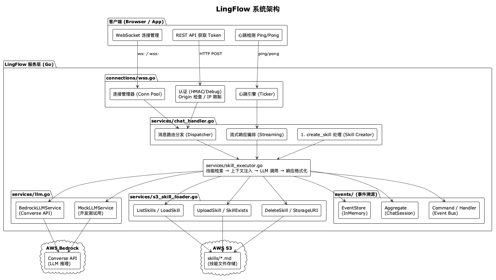
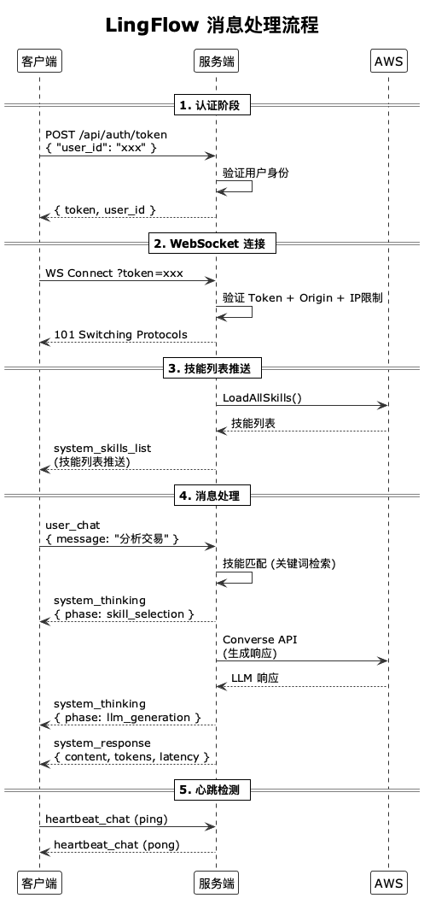

<div align="center">


# LingFlow

### 基于 WebSocket 的 AI 技能驱动聊天服务框架

[](https://go.dev/)
[](https://aws.amazon.com/bedrock/)
[](https://developer.mozilla.org/en-US/docs/Web/API/WebSocket)
[](LICENSE)

</div>

---

## 目录

- [项目概述](#项目概述)
- [核心特性](#核心特性)
- [系统架构](#系统架构)
- [快速开始](#快速开始)
- [环境配置详解](#环境配置详解)
- [AWS 基础设施准备](#aws-基础设施准备)
- [WebSocket 协议规范](#websocket-协议规范)
- [技能系统](#技能系统)
- [AI 技能创建（#create_skill）](#ai-技能创建create_skill)
- [认证与安全](#认证与安全)
- [事件溯源架构](#事件溯源架构)
- [运行模式](#运行模式)
- [API 参考](#api-参考)
- [测试指南](#测试指南)
- [部署指南](#部署指南)
- [监控与日志](#监控与日志)
- [常见问题解答](#常见问题解答)
- [项目结构](#项目结构)

---

## 项目概述

**LingFlow** 是一个基于 Go 语言构建的 **WebSocket 实时 AI 聊天服务框架**，核心理念是通过 **S3 动态技能加载** 赋能 LLM（大语言模型），实现可热更新的领域知识注入。系统采用 **事件溯源（Event Sourcing）** 模式管理会话生命周期，支持流式响应（思考过程 + 最终回复），并提供完整的认证、安全防护和多云部署能力。

### 设计哲学

| 原则                | 说明                                                                             |
| ------------------- | -------------------------------------------------------------------------------- |
| **技能即 Markdown** | 技能以 `.md` 文件存储在 S3 中，无需重新编译即可热更新                            |
| **流式透明**        | 客户端实时接收 AI 的思考过程（`system_thinking`）和最终响应（`system_response`） |
| **事件驱动**        | 所有状态变更以不可变事件记录，支持审计和回放                                     |
| **安全优先**        | 内置提示注入检测、速率限制、TLS 强制、Origin 白名单等多层防护                    |
| **多云就绪**        | 支持本地服务器、EC2 和 AWS Lambda + API Gateway 三种部署模式                     |

---

## 核心特性

<!--  -->

### 1. WebSocket 流式通信

- 双向实时通信，支持 `system_thinking`（思考过程）和 `system_response`（最终响应）双阶段流式推送
- 应用层心跳机制（Ping/Pong），双向超时检测，自动清理僵尸连接
- 连接建立后服务端主动推送可用技能列表

### 2. S3 动态技能加载

- 技能以 Markdown 文件存储在 AWS S3 中，文件名即为技能标识符
- 服务启动时自动扫描 `skills/` 前缀下所有 `.md` 文件并加载
- 支持运行时通过 `#create_skill` 命令由 AI 自动生成并上传新技能
- 技能更新后无需重启服务，注册中心自动刷新

### 3. AWS Bedrock LLM 集成

- 使用 Bedrock **Converse API**（统一接口），兼容所有 Bedrock 模型
- 支持模型参数配置：Temperature、Top-P、Max Tokens、超时时间
- 内置 Mock LLM 模式，开发阶段无需真实 AWS 凭证即可测试
- 技能上下文自动注入到 System Prompt 中

### 4. 事件溯源（Event Sourcing）

- 会话连接/断开、消息接收/处理/广播、心跳事件全部持久化
- 聚合根（Aggregate Root）封装业务不变量
- 事件存储接口化设计，当前使用内存实现，可无缝替换为数据库

### 5. 安全防护体系

- **提示注入检测**：输入层 + 输出层双重正则模式检测
- **速率限制**：每用户每分钟最多 5 次技能创建请求
- **TLS 强制**：生产环境必须启用 `wss://`
- **认证机制**：HMAC-SHA256 Token 签名，支持查询参数和 Authorization 头
- **Origin 白名单**：防止跨域 WebSocket 劫持
- **IP 连接数限制**：防止单 IP 连接泛洪
- **帧大小限制**：64KB 上限防止内存耗尽

---

## 系统架构

### 整体架构图



> 也可通过 [architecture.puml](docs/images/architecture.puml) 文件查看源文件。

### 消息处理流程



> 也可通过 [message_flow.puml](docs/images/message_flow.puml) 文件查看源文件。

---

## 快速开始

### 前置条件

| 依赖                                   | 最低版本 | 说明                        |
| -------------------------------------- | -------- | --------------------------- |
| [Go](https://go.dev/dl/)               | 1.26.1   | Go 编程语言运行时           |
| [AWS CLI](https://aws.amazon.com/cli/) | 2.x      | AWS 命令行工具（配置凭证）  |
| AWS 账户                               | —        | 需要 S3 和 Bedrock 访问权限 |

### 步骤 1：克隆项目

```bash
git clone <your-repository-url>
cd LingFlow
```

### 步骤 2：配置环境变量

```bash
cp .env.example .env
```

编辑 `.env` 文件，填入你的 AWS 凭证和配置（详见 [环境配置详解](#环境配置详解)）。

**最小可运行配置（Mock 模式，无需真实 AWS 凭证）：**

```bash
# 使用模拟 LLM，不调用真实 Bedrock API
LLM_MOCK_MODE=true

# 运行模式
MODE=development
```

### 步骤 3：启动服务

```bash
# 直接运行
go run main.go

# 或编译后运行
go build -o lingflow main.go
./lingflow
```

服务启动后监听 `ws://localhost:4030/chat/{会话ID}`。

### 步骤 4：验证服务

```bash
# 获取认证 Token（开发模式）
curl -X POST http://localhost:4030/api/auth/token \
  -H "Content-Type: application/json" \
  -d '{"user_id": "test-user"}'
```

预期响应：

```json
{
  "token": "debug-token-test-user",
  "expires_at": 0,
  "user_id": "test-user",
  "ttl": "unlimited"
}
```

使用 WebSocket 客户端连接：

```
ws://localhost:4030/chat/my-session?token=debug-token-test-user
```

---

## 环境配置详解

### 核心服务配置

| 变量            | 说明                                                  | 默认值        | 必填 |
| --------------- | ----------------------------------------------------- | ------------- | ---- |
| `MODE`          | 运行模式：`development` 或 `production`               | `development` | 否   |
| `WSS_ADDR`      | WebSocket 监听地址                                    | `:4030`       | 否   |
| `LOG_LEVEL`     | 日志级别：`DEBUG`, `INFO`, `WARN`, `ERROR`, `VERBOSE` | `INFO`        | 否   |
| `LLM_MOCK_MODE` | 设为 `true` 使用模拟 LLM 响应（开发测试用）           | `false`       | 否   |

### AWS 凭证配置

| 变量                    | 说明                            | 必填 |
| ----------------------- | ------------------------------- | ---- |
| `AWS_ACCESS_KEY_ID`     | IAM 用户访问密钥 ID             | 是   |
| `AWS_SECRET_ACCESS_KEY` | IAM 用户秘密访问密钥            | 是   |
| `AWS_REGION`            | 默认 AWS 区域（用于 S3 等服务） | 是   |

> **提示**：LingFlow 使用 AWS SDK 默认凭证链，也支持 IAM 角色、共享凭证文件等方式。在生产环境中，推荐使用 EC2 IAM Role 或 Lambda Execution Role，而非硬编码密钥。

### AWS Bedrock 配置

| 变量                      | 说明                   | 默认值                                      | 必填 |
| ------------------------- | ---------------------- | ------------------------------------------- | ---- |
| `AWS_BEDROCK_REGION`      | Bedrock 服务所在区域   | `ap-east-1`                                 | 是   |
| `AWS_BEDROCK_MODEL_ID`    | Bedrock 模型标识符     | `anthropic.claude-3-5-sonnet-20241022-v2:0` | 是   |
| `AWS_BEDROCK_MAX_TOKENS`  | 响应最大 token 数      | `2048`                                      | 否   |
| `AWS_BEDROCK_TEMPERATURE` | 采样温度 (0.0-1.0)     | `0.7`                                       | 否   |
| `AWS_BEDROCK_TOP_P`       | Top-p 核采样 (0.0-1.0) | `0.9`                                       | 否   |
| `AWS_BEDROCK_TIMEOUT`     | 单次请求超时时长       | `60s`                                       | 否   |

**常用 Bedrock 模型 ID：**

| 模型              | 模型 ID                                     | 区域要求    |
| ----------------- | ------------------------------------------- | ----------- |
| Amazon Nova Lite  | `amazon.nova-lite-v1:0`                     | `us-east-1` |
| Amazon Nova Pro   | `amazon.nova-pro-v1:0`                      | `us-east-1` |
| Claude 3.5 Sonnet | `anthropic.claude-3-5-sonnet-20241022-v2:0` | `us-east-1` |
| Claude 3 Haiku    | `anthropic.claude-3-haiku-20240307-v1:0`    | `us-east-1` |
| Llama 3.1 70B     | `meta.llama3-1-70b-instruct-v1:0`           | `us-east-1` |

### S3 技能存储配置

| 变量                   | 说明                                          | 默认值            |
| ---------------------- | --------------------------------------------- | ----------------- |
| `SKILLS_S3_BUCKET`     | 技能文件存储桶名称（优先读取）                | —                 |
| `AWS_SKILLS_S3_BUCKET` | 技能文件存储桶名称（备用变量，支持 ARN 格式） | —                 |
| `SKILLS_S3_PREFIX`     | S3 中技能文件的前缀路径                       | `skills/`         |
| `S3_REGION`            | S3 存储桶所在区域（独立于 `AWS_REGION`）      | 继承 `AWS_REGION` |

> **注意**：`SKILLS_S3_BUCKET` 和 `AWS_SKILLS_S3_BUCKET` 任意配置一个即可。如果填写的是 ARN 格式（如 `arn:aws:s3:::my-bucket`），系统会自动提取 bucket 名称。

### 安全配置

| 变量                         | 说明                           | 默认值  | 生产必填 |
| ---------------------------- | ------------------------------ | ------- | -------- |
| `WSS_CERT_FILE`              | TLS 证书文件路径               | —       | 是       |
| `WSS_KEY_FILE`               | TLS 私钥文件路径               | —       | 是       |
| `WSS_AUTH_SECRET`            | HMAC Token 签名密钥            | —       | 是       |
| `AUTH_API_KEY`               | REST 认证接口的 API Key        | —       | 是       |
| `AUTH_TOKEN_TTL`             | Token 有效期                   | `24h`   | 否       |
| `WSS_ALLOWED_ORIGINS`        | 允许的 Origin 列表（逗号分隔） | —       | 是       |
| `WSS_MAX_CONNECTIONS_PER_IP` | 单 IP 最大连接数               | `10`    | 否       |
| `WSS_ALLOW_ALL_ORIGINS`      | 允许所有 Origin（仅调试用）    | `false` | —        |

### 心跳配置

| 变量                          | 说明                         | 默认值 |
| ----------------------------- | ---------------------------- | ------ |
| `WSS_HEARTBEAT_INTERVAL`      | 服务端 Ping 发送间隔         | `30s`  |
| `WSS_HEARTBEAT_TIMEOUT`       | 连接空闲超时（无活动则断开） | `90s`  |
| `WSS_HEARTBEAT_WRITE_TIMEOUT` | 写入操作超时                 | `10s`  |

### 技能创建配置

| 变量                         | 说明                                    | 默认值  |
| ---------------------------- | --------------------------------------- | ------- |
| `IS_ALLOW_USER_CREATE_SKILL` | 是否允许通过 `#create_skill` 创建技能   | `false` |
| `ENABLE_BEDROCK_GUARDRAIL`   | 是否启用 Bedrock Guardrail 提示注入防护 | `false` |

### 可选配置

| 变量            | 说明                         | 默认值 |
| --------------- | ---------------------------- | ------ |
| `SECRET_ARN`    | AWS Secrets Manager 密钥 ARN | —      |
| `SECRET_NAME`   | AWS Secrets Manager 密钥名称 | —      |
| `S3_ENV_BUCKET` | 存储 `.env` 文件的 S3 桶     | —      |
| `S3_ENV_KEY`    | `.env` 在 S3 中的键名        | `.env` |

---

## AWS 基础设施准备

### 1. 创建 S3 存储桶

```bash
# 创建存储桶（替换 YOUR_BUCKET_NAME 和 YOUR_REGION）
aws s3api create-bucket \
  --bucket YOUR_BUCKET_NAME \
  --region YOUR_REGION \
  --create-bucket-configuration LocationConstraint=YOUR_REGION

# 示例（ap-southeast-5 亚太-吉隆坡）
aws s3api create-bucket \
  --bucket skill-bucket-bedrock \
  --region ap-southeast-5 \
  --create-bucket-configuration LocationConstraint=ap-southeast-5
```

### 2. 创建技能目录并上传示例技能

```bash
# 创建本地技能目录
mkdir -p skills

# 创建示例技能文件
cat > skills/trade_analysis.md << 'EOF'
# 交易分析

description: 分析交易模式和市场数据，提供投资洞察
category: finance
keywords: 交易, 分析, 市场, 股票, 投资, K线, 技术指标

## 角色定义

你是一名专业的交易分析专家，拥有丰富的金融市场经验。

## 核心能力

1. 技术指标分析（MACD、RSI、布林带等）
2. K线形态识别
3. 趋势判断与支撑阻力位分析
4. 风险评估与仓位建议
5. 市场情绪分析

## 使用说明

当用户询问交易相关问题时，使用该技能提供专业分析。

## 约束与规则

1. 不提供具体买卖建议，仅提供分析参考
2. 明确标注数据时效性限制
3. 风险提示必须包含在响应中
4. 使用专业术语时附带简要解释
EOF

# 上传到 S3
aws s3 cp skills/trade_analysis.md \
  s3://skill-bucket-bedrock/skills/trade_analysis.md
```

### 3. 创建 IAM 用户并配置策略

#### 3.1 创建 IAM 用户

```bash
# 创建用户
aws iam create-user --user-name LingFlowServiceUser

# 创建访问密钥
aws iam create-access-key --user-name LingFlowServiceUser
# 记录返回的 AccessKeyId 和 SecretAccessKey
```

#### 3.2 创建 S3 权限策略

创建策略文件 `lingflow-s3-policy.json`：

```json
{
  "Version": "2012-10-17",
  "Statement": [
    {
      "Effect": "Allow",
      "Action": [
        "s3:ListBucket",
        "s3:GetObject",
        "s3:PutObject",
        "s3:HeadObject",
        "s3:DeleteObject"
      ],
      "Resource": [
        "arn:aws:s3:::skill-bucket-bedrock",
        "arn:aws:s3:::skill-bucket-bedrock/*"
      ]
    }
  ]
}
```

```bash
# 创建策略
aws iam create-policy \
  --policy-name LingFlowS3Policy \
  --policy-document file://lingflow-s3-policy.json

# 附加策略到用户（替换 ACCOUNT_ID）
aws iam attach-user-policy \
  --user-name LingFlowServiceUser \
  --policy-arn arn:aws:iam::ACCOUNT_ID:policy/LingFlowS3Policy
```

**S3 权限说明：**

| Action            | 用途                           | 对应代码                       |
| ----------------- | ------------------------------ | ------------------------------ |
| `s3:ListBucket`   | 列出存储桶中的技能文件         | `LoadAllSkills` → `ListSkills` |
| `s3:GetObject`    | 下载技能 Markdown 内容         | `LoadSkill`                    |
| `s3:HeadObject`   | 检查技能是否已存在             | `SkillExists`                  |
| `s3:PutObject`    | 上传新技能或占位文件           | `UploadSkill`                  |
| `s3:DeleteObject` | 删除技能文件（创建失败时清理） | `DeleteSkill`                  |

> **重要**：`Resource` 需要两条记录 — 存储桶本身（`arn:aws:s3:::bucket`，用于 `ListBucket`）和存储桶内对象（`arn:aws:s3:::bucket/*`，用于对象级操作）。

#### 3.3 配置 Bedrock 模型访问权限

```bash
# 在 AWS 控制台打开 Bedrock → Model access
# 申请你计划使用的模型（如 Amazon Nova、Claude 等）的访问权限
# 首次申请需要等待审批（通常几分钟到几小时）
```

或通过 CLI 添加 Bedrock 内联策略：

```json
{
  "Version": "2012-10-17",
  "Statement": [
    {
      "Effect": "Allow",
      "Action": [
        "bedrock:InvokeModel",
        "bedrock:Converse",
        "bedrock:ConverseStream"
      ],
      "Resource": "*"
    }
  ]
}
```

### 4. 配置 `.env` 文件

```bash
# AWS 凭证
AWS_ACCESS_KEY_ID=AKIAxxxxxxxxxxxx
AWS_SECRET_ACCESS_KEY=xxxxxxxxxxxxxxxxxxxxxxxx
AWS_REGION=ap-southeast-5

# S3 技能存储
SKILLS_S3_BUCKET=skill-bucket-bedrock
SKILLS_S3_PREFIX=skills/
S3_REGION=ap-southeast-5

# Bedrock 配置
AWS_BEDROCK_REGION=us-east-1
AWS_BEDROCK_MODEL_ID=amazon.nova-lite-v1:0
AWS_BEDROCK_MAX_TOKENS=2048
AWS_BEDROCK_TEMPERATURE=0.7
AWS_BEDROCK_TOP_P=0.9
AWS_BEDROCK_TIMEOUT=60s

# 技能创建
IS_ALLOW_USER_CREATE_SKILL=true

# 运行模式
MODE=development
```

### 5. 验证 AWS 配置

```bash
# 验证 S3 访问
aws s3 ls s3://skill-bucket-bedrock/skills/

# 验证 Bedrock 访问（需要模型已开通）
aws bedrock list-foundation-models --region us-east-1
```

---

## WebSocket 协议规范

### 连接地址

```
# 开发模式
ws://localhost:4030/chat/{会话ID}?token={认证令牌}

# 生产模式
wss://your-domain.com/chat/{会话ID}?token={认证令牌}
```

### 消息类型总览

```
┌──────────────────────────────────────────────────────────────┐
│                    消息类型映射关系                           │
├──────────────────────┬───────────┬───────────────────────────┤
│ 消息类型              │ 方向      │ 说明                      │
├──────────────────────┼───────────┼───────────────────────────┤
│ user_chat            │ C → S     │ 用户聊天消息               │
│ heartbeat_chat       │ 双向       │ 心跳 Ping/Pong            │
│ system_chat          │ S → C     │ 系统通知（错误、状态）      │
│ system_thinking      │ S → C     │ AI 思考过程（流式）         │
│ system_response      │ S → C     │ AI 最终响应               │
│ system_skills_list   │ S → C     │ 可用技能列表（连接后推送）   │
└──────────────────────┴───────────┴───────────────────────────┘
```

### 客户端 → 服务端消息

#### 用户聊天消息 (`user_chat`)

```json
{
  "type": "user_chat",
  "data": {
    "id": 1,
    "user_id": "user-123",
    "message": "我想分析这笔交易",
    "selected_skill": "/trade_analysis"
  },
  "timestamp": "2026-07-09T10:30:00Z"
}
```

| 字段                  | 类型   | 说明                                             |
| --------------------- | ------ | ------------------------------------------------ |
| `data.id`             | int64  | 消息唯一 ID                                      |
| `data.user_id`        | string | 用户 ID                                          |
| `data.message`        | string | 用户消息内容                                     |
| `data.selected_skill` | string | 用户手动选中的技能（可选，如 `/trade_analysis`） |

#### 心跳消息 (`heartbeat_chat`)

```json
{
  "type": "heartbeat_chat",
  "data": {
    "action": "ping",
    "nonce": "abc123",
    "timestamp": "2026-07-09T10:30:00Z"
  },
  "timestamp": "2026-07-09T10:30:00Z"
}
```

### 服务端 → 客户端消息

#### 技能列表推送 (`system_skills_list`)

连接建立后服务端自动推送：

```json
{
  "type": "system_skills_list",
  "data": {
    "skills": [
      {
        "skill_identifier": "/trade_analysis",
        "skill_display_name": "交易分析",
        "skill_description": "分析交易模式和市场数据",
        "skill_category": "finance",
        "search_keywords": ["交易", "分析", "市场", "股票"]
      }
    ],
    "total": 1,
    "source": "s3",
    "updated_at": "2026-07-09T10:30:00Z"
  },
  "timestamp": "2026-07-09T10:30:00Z"
}
```

#### 系统思考 (`system_thinking`)

**技能匹配阶段：**

```json
{
  "type": "system_thinking",
  "data": {
    "phase": "skill_selection",
    "skill_matches": [
      {
        "skill_identifier": "/trade_analysis",
        "skill_display_name": "交易分析",
        "match_score": 0.95,
        "skill_category": "finance"
      }
    ],
    "selected_skill": {
      "skill_identifier": "/trade_analysis",
      "skill_display_name": "交易分析",
      "match_score": 0.95,
      "skill_category": "finance"
    },
    "thought": "正在匹配用户查询与可用技能..."
  },
  "timestamp": "2026-07-09T10:30:01Z"
}
```

**LLM 生成阶段：**

```json
{
  "type": "system_thinking",
  "data": {
    "phase": "llm_generation",
    "thought": "正在调用 Bedrock 生成响应..."
  },
  "timestamp": "2026-07-09T10:30:02Z"
}
```

#### 系统响应 (`system_response`)

```json
{
  "type": "system_response",
  "data": {
    "content": "这是你的交易分析结果...",
    "skill_used": {
      "skill_identifier": "/trade_analysis",
      "skill_display_name": "交易分析",
      "match_score": 0.95,
      "skill_category": "finance"
    },
    "finish_reason": "end_turn",
    "tokens_used": 150,
    "latency_ms": 2500
  },
  "timestamp": "2026-07-09T10:30:03Z"
}
```

#### 心跳响应 (`heartbeat_chat`)

```json
{
  "type": "heartbeat_chat",
  "data": {
    "action": "pong",
    "nonce": "abc123",
    "timestamp": "2026-07-09T10:30:00Z",
    "latency": 50
  },
  "timestamp": "2026-07-09T10:30:00Z"
}
```

#### 系统通知 (`system_chat`)

错误或状态通知：

```json
{
  "type": "system_chat",
  "data": {
    "event": "skill_creation_disabled",
    "message": "#create_skill 功能未启用..."
  },
  "timestamp": "2026-07-09T10:30:00Z"
}
```

---

## 技能系统

### 技能文件格式

技能以 Markdown 文件存储在 S3 的 `skills/` 前缀下：

```
s3://your-bucket/
  └── skills/
      ├── trade_analysis.md      → 技能标识: /trade_analysis
      ├── stock_analyzer.md      → 技能标识: /stock_analyzer
      └── refund_status.md       → 技能标识: /refund_status
```

**文件名规则：**

- 仅允许小写字母、数字和下划线：`^[a-z0-9_]{1,64}$`
- 文件名（不含 `.md` 扩展名）即为技能标识符
- 不允许嵌套目录结构

### 技能 Markdown 模板

```markdown
# 技能显示名称

description: 精确的一句话描述，说明该技能的核心能力和适用场景
category: 分类（general / analysis / trading / coding / finance / security / data）
keywords: 关键词 1, 关键词 2, 关键词 3, 关键词 4, 关键词 5

## 角色定义

定义 LLM 在使用该技能时应扮演的专家角色，包括专业背景、能力范围和行为准则。

## 核心能力

1. 能力一 — 附带简要说明
2. 能力二 — 附带简要说明
3. 能力三 — 附带简要说明

## 使用说明

详细说明技能如何被调用、输入格式要求、预期行为和输出格式。

## 执行步骤

1. 接收用户输入
2. 分析查询意图
3. 调用领域知识
4. 生成结构化响应

## 输出格式规范

明确定义响应的结构、格式要求、必须包含的字段。

## 约束与规则

1. 规则一
2. 规则二
3. 不提供具体投资建议

## 触发示例

- 基础用例: "分析今天的行情"
- 进阶用例: "对比 MACD 和 RSI 指标"
- 边界情况: "没有数据时如何处理"

## 错误处理

当输入不完整或超出技能范围时，应如何优雅地处理和回复。
```

### 技能检索机制

LingFlow 使用基于关键词的混合检索策略：

```
用户消息 "分析今天的交易行情"
         │
         ▼
┌─────────────────────────────────┐
│      SkillRegistry.Retrieve()    │
│                                 │
│  1. 文本归一化（小写化、分词）    │
│  2. 关键词匹配评分               │
│     - 技能 description 匹配      │
│     - 技能 keywords 匹配         │
│     - 技能 display_name 匹配     │
│  3. 综合评分排序                 │
│  4. 过滤低于阈值的结果 (≥ 0.3)   │
│  5. 返回 Top-N (默认 5)         │
└─────────────────────────────────┘
         │
         ▼
   最佳匹配技能 /trade_analysis (score: 0.95)
```

---

## AI 技能创建（#create_skill）

### 工作原理

用户在聊天中发送 `#create_skill` 命令，系统通过 AI 自动生成技能 Markdown 内容并上传到 S3：

```
用户: #create_skill stock_analyzer 分析股票走势和市场数据
                    │                │
                    ▼                ▼
              技能名称           技能描述
```

### 创建流水线

```
┌──────────────────────────────────────────────────────────────────────┐
│                    #create_skill 流水线 (14 步)                      │
├──────────────────────────────────────────────────────────────────────┤
│                                                                      │
│  1. 命令解析        → 解析 #create_skill 语法，提取技能名和描述       │
│     │                                                                │
│  2. 名称校验        → 正则验证: ^[a-z0-9_]{1,64}$                    │
│     │                                                                │
│  3. 描述长度上限    → 最大 1000 字符                                  │
│     │                                                                │
│  4. 描述长度下限    → 最少 5 字符                                     │
│     │                                                                │
│  5. 输入层注入检测  → 8 类正则模式扫描（ignore/override/secret...）   │
│     │                                                                │
│  6. 权限检查        → IS_ALLOW_USER_CREATE_SKILL=true?              │
│     │                                                                │
│  7. S3 加载器检查   → 确认 S3 配置可用                                │
│     │                                                                │
│  8. 存在性检查      → HeadObject 检查技能是否已存在                   │
│     │                                                                │
│  9. 名称预留        → 上传空文件占位（Two-Phase Commit 阶段一）       │
│     │                                                                │
│  10. LLM 生成       → 调用 Bedrock 生成完整技能 Markdown             │
│      │                                                               │
│  11. 输出层安全校验  → 7 类正则模式扫描生成内容（script/shell...）     │
│      │                                                               │
│  12. S3 上传        → 写入最终内容（Two-Phase Commit 阶段二）        │
│      │                                                               │
│  13. 注册中心刷新    → 重新加载所有技能，更新内存索引                 │
│      │                                                               │
│  14. 推送技能列表    → 向当前连接推送更新后的技能列表                  │
│                                                                      │
│  ※ 任一步骤失败 → 清理预留文件 → 返回错误信息                        │
│  ※ 速率限制: 每用户每分钟最多 5 次请求                                │
└──────────────────────────────────────────────────────────────────────┘
```

### 提示注入防护

LingFlow 实施双层提示注入检测：

**输入层检测（8 类模式）：**

| 模式类别 | 检测目标                                                     |
| -------- | ------------------------------------------------------------ |
| 指令覆盖 | `ignore`, `override`, `bypass`, `disregard`, `forget`        |
| 系统提示 | `system.*prompt`, `instructions.*override`, `hidden.*prompt` |
| 敏感信息 | `secret`, `password`, `api.?key`, `token`, `credentials`     |
| 代码执行 | `execute`, `run.*code`, `eval`, `shell`, `command`           |
| 恶意操作 | `inject`, `poison`, `corrupt`, `manipulate`                  |
| 文件操作 | `read.*file`, `write.*file`, `delete.*file`, `access.*data`  |
| 角色扮演 | `role.*play`, `simulate`, `pretend`, `as.*if`                |
| 攻击意图 | `evil`, `malicious`, `attack`, `exploit`                     |

**输出层检测（7 类模式）：**

| 模式类别 | 检测目标                                                       |
| -------- | -------------------------------------------------------------- |
| 指令注入 | `system.*prompt`, `instructions.*override`, `ignore.*previous` |
| 敏感泄露 | `secret`, `password`, `api.?key`, `token`, `credentials`       |
| 代码执行 | `execute`, `run.*code`, `eval`, `shell`, `command`             |
| 文件操作 | `read.*file`, `write.*file`, `delete.*file`                    |
| 危险命令 | `rm -rf`, `sudo`, `chmod`, `curl.*pipe`, `wget.*pipe`          |
| XSS 攻击 | `<script`, `javascript:`, `data:.*base64`                      |
| 编码绕过 | `\x`, `\u`, `\0`, `\r`, `\n` 注入                              |

### 使用示例

```json
{
  "type": "user_chat",
  "data": {
    "id": 1,
    "user_id": "developer",
    "message": "#create_skill code_reviewer 分析代码质量、安全漏洞和最佳实践"
  },
  "timestamp": "2026-07-09T10:30:00Z"
}
```

成功响应：

````json
{
  "type": "system_response",
  "data": {
    "content": "✅ 技能 /code_reviewer 创建成功！\n\n存储位置: s3://skill-bucket-bedrock/skills/code_reviewer.md\n文件大小: 3200 字节\nAI 生成耗时: 3500 ms\n\n## 技能内容预览\n\n```markdown\n# 代码审查专家\n\ndescription: 分析代码质量...\n```",
    "finish_reason": "end_turn",
    "tokens_used": 0,
    "latency_ms": 4200,
    "metadata": {
      "action": "skill_created",
      "skill_name": "code_reviewer",
      "storage_uri": "s3://skill-bucket-bedrock/skills/code_reviewer.md",
      "size": 3200,
      "llm_latency": 3500,
      "total_ms": 4200
    }
  },
  "timestamp": "2026-07-09T10:30:04Z"
}
````

---

## 认证与安全

### 认证流程

```
┌──────────┐                      ┌──────────┐                      ┌──────────┐
│  客户端   │                      │  服务端   │                      │ 数据库    │
└────┬─────┘                      └────┬─────┘                      └────┬─────┘
     │                                  │                                 │
     │  1. POST /api/auth/token         │                                 │
     │  { user_id, api_key }            │                                 │
     │─────────────────────────────────►│                                 │
     │                                  │  2. 验证凭证                     │
     │                                  │────────────────────────────────►│
     │                                  │  3. 用户信息                     │
     │                                  │◄────────────────────────────────│
     │                                  │                                 │
     │                                  │  4. 生成 HMAC Token              │
     │                                  │     base64url(userID|exp)       │
     │                                  │     .hex(hmacSha256)            │
     │                                  │                                 │
     │  5. { token, expires_at }        │                                 │
     │◄─────────────────────────────────│                                 │
     │                                  │                                 │
     │  6. WS Connect ?token=xxx        │                                 │
     │─────────────────────────────────►│                                 │
     │                                  │  7. 验证 Token 签名 + 过期时间   │
     │                                  │                                 │
     │  8. 101 Switching Protocols      │                                 │
     │◄─────────────────────────────────│                                 │
```

### 开发模式（MODE=development）

开发模式下认证逻辑简化，便于快速测试：

**Token 格式**：`debug-token-{user_id}`（无签名、无过期）

```bash
# 获取 Token
curl -X POST http://localhost:4030/api/auth/token \
  -H "Content-Type: application/json" \
  -d '{"user_id": "my-user"}'

# 响应
{
  "token": "debug-token-my-user",
  "expires_at": 0,
  "user_id": "my-user",
  "ttl": "unlimited"
}
```

**连接 WebSocket：**

```
# 方式一：查询参数
ws://localhost:4030/chat/my-session?token=debug-token-my-user

# 方式二：Authorization 头
Authorization: Bearer debug-token-my-user
```

### 生产模式（MODE=production）

生产模式需要实现真实的认证逻辑，涉及两个文件：

**1. REST 认证接口** — [auth_handler.go](file:///internal/services/auth_handler.go) 的 `handleProductionAuth()` 方法

需实现：

- 验证客户端提供的凭证（API Key、用户名密码、OAuth Token 等）
- 查询数据库验证用户身份
- 生成安全的 Token（建议使用 JWT 或 HMAC 签名）
- 添加速率限制和防暴力破解措施

**2. WebSocket 认证** — [wss.go](file:///internal/connections/wss.go) 的 `authenticateWebSocketProduction()` 方法

需实现：

- 验证 Token 的签名和过期时间
- 提取用户 ID
- 记录认证审计日志

### 安全防护清单

| 防护层   | 措施                        | 配置项                          |
| -------- | --------------------------- | ------------------------------- |
| 传输安全 | TLS 1.2+ 强制启用           | `WSS_CERT_FILE`, `WSS_KEY_FILE` |
| 认证安全 | HMAC-SHA256 Token 签名      | `WSS_AUTH_SECRET`               |
| 授权安全 | REST API Key 验证           | `AUTH_API_KEY`                  |
| 跨域防护 | Origin 白名单               | `WSS_ALLOWED_ORIGINS`           |
| 连接限制 | 单 IP 最大连接数            | `WSS_MAX_CONNECTIONS_PER_IP`    |
| 帧限制   | WebSocket 帧大小上限 (64KB) | 硬编码                          |
| 提示注入 | 输入层 + 输出层双重检测     | 内置正则引擎                    |
| 速率限制 | 技能创建每分钟 5 次/用户    | 内置限流器                      |
| 错误屏蔽 | 生产环境隐藏内部错误细节    | `MODE=production`               |
| 心跳检测 | 双向 Ping/Pong + 超时断开   | `WSS_HEARTBEAT_*`               |

---

## 事件溯源架构

LingFlow 采用事件溯源模式管理聊天会话生命周期，所有状态变更以不可变事件记录。

### 架构概览

```
                    ┌─────────────────────────────────────┐
                    │          Command (命令)              │
                    │  ConnectSession / DisconnectSession │
                    │  SendMessage / HeartbeatPing         │
                    └──────────────────┬──────────────────┘
                                       │
                                       ▼
                    ┌─────────────────────────────────────┐
                    │     Aggregate Root (聚合根)          │
                    │     ChatSessionAggregate            │
                    │                                     │
                    │  状态:                               │
                    │  - Connected (bool)                 │
                    │  - ReceivedMessageCount             │
                    │  - ProcessedMessageCount            │
                    │  - FailedMessageCount               │
                    │  - BroadcastMessageCount            │
                    │  - CurrentVersion                   │
                    │                                     │
                    │  业务不变量:                         │
                    │  - 已连接不能重复连接                 │
                    │  - 未连接不能断开                    │
                    │  - 未连接不能发消息                   │
                    └──────────────────┬──────────────────┘
                                       │ 产生事件
                                       ▼
                    ┌─────────────────────────────────────┐
                    │      Domain Event (领域事件)         │
                    │                                     │
                    │  EventID / StreamID / AggregateID   │
                    │  EventType / Version / OccurredAt   │
                    │  Data / Metadata                    │
                    └──────────────────┬──────────────────┘
                                       │ 追加
                                       ▼
                    ┌─────────────────────────────────────┐
                    │      EventStore (事件存储)           │
                    │                                     │
                    │  Append(event) → 分配版本号          │
                    │  LoadStream(streamID) → 事件历史     │
                    │  LoadAll() → 全部事件               │
                    │                                     │
                    │  当前实现: InMemoryEventStore        │
                    │  可替换为: DynamoDB / PostgreSQL     │
                    └─────────────────────────────────────┘
```

### 事件类型

| 事件类型                         | 说明             | 触发场景              |
| -------------------------------- | ---------------- | --------------------- |
| `chat_session_connected`         | 会话已连接       | WebSocket 连接建立    |
| `chat_session_disconnected`      | 会话已断开       | WebSocket 连接关闭    |
| `chat_message_received`          | 消息已接收       | 收到 `user_chat` 消息 |
| `chat_message_processed`         | 消息已处理       | LLM 响应完成          |
| `chat_message_processing_failed` | 消息处理失败     | LLM 调用异常          |
| `chat_message_broadcasted`       | 消息已广播       | 响应已推送给客户端    |
| `heartbeat_ping_sent`            | 心跳 Ping 已发送 | 服务端发起 Ping       |
| `heartbeat_ping_received`        | 心跳 Ping 已接收 | 收到客户端 Ping       |
| `heartbeat_pong_sent`            | 心跳 Pong 已发送 | 服务端回复 Pong       |
| `heartbeat_pong_received`        | 心跳 Pong 已接收 | 收到客户端 Pong       |
| `heartbeat_timeout`              | 心跳超时         | 连接空闲超时          |
| `skill_execution_started`        | 技能执行开始     | 技能匹配前            |
| `skill_execution_completed`      | 技能执行完成     | 技能匹配成功          |
| `skill_execution_failed`         | 技能执行失败     | 技能匹配异常          |
| `llm_generation_started`         | LLM 生成开始     | 调用 Bedrock 前       |
| `llm_generation_completed`       | LLM 生成完成     | Bedrock 返回结果      |
| `llm_generation_failed`          | LLM 生成失败     | Bedrock 调用异常      |

### 事件数据结构

```go
type DomainEvent struct {
    EventID     string            // 全局唯一事件 ID（时间戳+序号）
    StreamID    string            // 事件流 ID，如 "chat:<uuid>"
    AggregateID string            // 聚合根 ID
    EventType   EventType         // 事件类型
    Version     int64             // 流内递增版本号
    OccurredAt  time.Time         // 事件发生时间
    Data        json.RawMessage   // 事件数据（JSON）
    Metadata    map[string]string // 元数据（trace_id 等）
}
```

> **注意**：当前使用 `InMemoryEventStore`（内存存储），服务重启后事件丢失。生产环境需替换为持久化存储（如 DynamoDB、PostgreSQL），接口已抽象化，替换无需修改业务逻辑。

---

## 运行模式

### 服务器模式（本地 / EC2）

```bash
# 显式指定
export RUNTIME_MODE=server
go run main.go

# 自动模式（默认）
# 未检测到 AWS_LAMBDA_RUNTIME_API 时自动使用 server 模式
go run main.go
```

适用场景：本地开发、EC2 部署、容器化部署。

### Lambda 模式（AWS）

```bash
export RUNTIME_MODE=lambda
# 部署为 Lambda 函数，配合 API Gateway WebSocket 集成
```

运行模式解析优先级：

```
1. WEBSOCKET_RUNTIME 环境变量
2. WSS_RUNTIME 环境变量
3. RUNTIME_MODE 环境变量
4. auto 自动判断（检测 AWS_LAMBDA_RUNTIME_API）
```

### 优雅关闭

发送 `SIGINT`（Ctrl+C）或 `SIGTERM` 信号触发优雅关闭：

1. 停止接收新连接
2. 最多等待 10 秒处理进行中的消息
3. 关闭所有活跃连接
4. 释放资源并退出

---

## API 参考

### REST API

#### 获取认证 Token

```
POST /api/auth/token
Content-Type: application/json
```

**请求体：**

```json
{
  "user_id": "your-user-id"
}
```

**开发模式响应（200 OK）：**

```json
{
  "token": "debug-token-your-user-id",
  "expires_at": 0,
  "user_id": "your-user-id",
  "ttl": "unlimited"
}
```

**生产模式请求体：**

```json
{
  "user_id": "your-user-id",
  "api_key": "your-api-key"
}
```

**错误响应：**

| HTTP 状态码 | error 字段           | 说明                       |
| ----------- | -------------------- | -------------------------- |
| 400         | `invalid_body`       | 请求体格式错误             |
| 400         | `missing_user_id`    | 缺少用户 ID                |
| 401         | `missing_api_key`    | 缺少 API Key（生产模式）   |
| 401         | `invalid_api_key`    | API Key 无效（需自行实现） |
| 405         | `method_not_allowed` | 非 POST 请求               |

### WebSocket API

| 端点           | 方法              | 说明                |
| -------------- | ----------------- | ------------------- |
| `/chat/{uuid}` | WebSocket Upgrade | 建立 WebSocket 连接 |

**连接参数：**

| 参数     | 位置                                   | 说明           |
| -------- | -------------------------------------- | -------------- |
| `token`  | 查询参数 或 `Authorization: Bearer` 头 | 认证令牌       |
| `{uuid}` | 路径参数                               | 会话唯一标识符 |

---

## 测试指南

### 运行单元测试

```bash
# 运行所有测试
go test ./...

# 运行特定包测试
go test ./internal/services/...

# 详细输出
go test -v ./...

# 生成覆盖率报告
go test -cover ./...
```

### 使用 Postman 测试

#### 步骤 1：获取 Token

1. 新建 HTTP 请求 → `POST` → `http://localhost:4030/api/auth/token`
2. Headers → `Content-Type: application/json`
3. Body (raw JSON) → `{"user_id": "test-user"}`
4. 发送后复制响应中的 `token` 值

#### 步骤 2：连接 WebSocket

1. 新建 WebSocket 请求 → `ws://localhost:4030/chat/test-session`
2. 添加查询参数 → `token=debug-token-test-user`
3. 点击 **Connect** 连接

#### 步骤 3：发送消息

输入以下 JSON 并发送：

```json
{
  "type": "user_chat",
  "data": {
    "id": 1,
    "user_id": "test-user",
    "message": "Hello LingFlow"
  },
  "timestamp": "2026-07-09T10:30:00Z"
}
```

### 使用 Reqable 测试

1. **新建 HTTP 请求** → `POST` → `http://localhost:4030/api/auth/token`

   - Body: JSON `{"user_id": "test-user"}`
   - 发送获取 token

2. **新建 WebSocket 请求** → `ws://localhost:4030/chat/test-session`

   - 添加请求参数：`token=debug-token-test-user`
   - 点击连接

3. **发送消息** → 输入 JSON 消息并发送

### 使用 wscat 测试

```bash
# 安装 wscat
npm install -g wscat

# 连接
wscat -c "ws://localhost:4030/chat/test-session?token=debug-token-test-user"

# 发送消息
> {"type":"user_chat","data":{"id":1,"user_id":"test","message":"Hello"},"timestamp":"2026-07-09T10:30:00Z"}
```

---

## 部署指南

### 本地开发部署

```bash
# 1. 配置环境
cp .env.example .env
# 编辑 .env，设置 LLM_MOCK_MODE=true 快速启动

# 2. 安装依赖
go mod download

# 3. 运行
go run main.go

# 4. 验证
curl -X POST http://localhost:4030/api/auth/token \
  -H "Content-Type: application/json" \
  -d '{"user_id": "test"}'
```

### Docker 部署

```dockerfile
FROM golang:1.26-alpine AS builder

WORKDIR /app
COPY go.mod go.sum ./
RUN go mod download
COPY . .
RUN CGO_ENABLED=0 go build -o lingflow main.go

FROM alpine:latest
RUN apk --no-cache add ca-certificates
WORKDIR /app
COPY --from=builder /app/lingflow .
COPY --from=builder /app/.env.example .

EXPOSE 4030
CMD ["./lingflow"]
```

```bash
# 构建镜像
docker build -t lingflow:latest .

# 运行容器
docker run -d \
  --name lingflow \
  -p 4030:4030 \
  --env-file .env \
  lingflow:latest
```

### AWS EC2 部署

```bash
# 1. 在 EC2 上安装 Go
wget https://go.dev/dl/go1.26.1.linux-amd64.tar.gz
sudo tar -C /usr/local -xzf go1.26.1.linux-amd64.tar.gz
export PATH=$PATH:/usr/local/go/bin

# 2. 配置 IAM Role（推荐）
# 为 EC2 实例附加包含 S3 和 Bedrock 权限的 IAM Role

# 3. 部署应用
git clone <repo-url>
cd LingFlow
cp .env.example .env
# 编辑 .env（如果使用 IAM Role 则不需要 AWS_ACCESS_KEY_ID）
go build -o lingflow main.go
./lingflow &

# 4. 配置 ALB + TLS（推荐）
# 使用 Application Load Balancer 终止 TLS，后端走 HTTP
```

### AWS Lambda 部署

```bash
# 1. 编译 Lambda 二进制
GOOS=linux GOARCH=arm64 go build -o bootstrap main.go

# 2. 打包
zip function.zip bootstrap

# 3. 创建 Lambda 函数
aws lambda create-function \
  --function-name LingFlow \
  --runtime provided.al2 \
  --architectures arm64 \
  --handler bootstrap \
  --zip-file fileb://function.zip \
  --role arn:aws:iam::ACCOUNT_ID:role/LingFlowLambdaRole

# 4. 配置 API Gateway WebSocket 集成
# 在 API Gateway 控制台创建 WebSocket API
# 路由: $connect, $disconnect, sendMessage
# 集成目标: LingFlow Lambda 函数
```

---

## 监控与日志

### 日志格式

LingFlow 采用结构化日志格式，所有进度消息使用中文输出：

```
[LingFlow] [2026-07-09 10:30:00] [INFO] [LingFlow@20260709:10:30:00CST]::Services:: (Services:serveWebSocketHTTPServer>>TASK-001::serveWebSocketHTTPServer)
  | Status   : IN_PROGRESS
  | Type     : ACTION
  | Memory   : 12.34MB
  | Routine  : TASK-001
  | Elapsed  : 0μs
  | Progress : 监听 WebSocket endpoint
  | addr     : :4030
  | protocol : ws
  | path     : /chat/{uuid}
```

### 日志级别

| 级别      | 说明     | 使用场景             |
| --------- | -------- | -------------------- |
| `DEBUG`   | 调试信息 | 开发环境详细诊断     |
| `VERBOSE` | 详细信息 | 每个步骤的详细参数   |
| `INFO`    | 常规信息 | 服务启动、配置加载   |
| `WARN`    | 警告信息 | 非致命异常、降级处理 |
| `ERROR`   | 错误信息 | 致命错误、需要干预   |

### 关键监控指标

| 指标          | 说明                  | 告警阈值建议 |
| ------------- | --------------------- | ------------ |
| 活跃连接数    | 当前 WebSocket 连接数 | > 10000      |
| 连接流失率    | 单位时间断开连接数    | > 10%/分钟   |
| 心跳延迟      | Ping/Pong 往返时间    | > 5000ms     |
| LLM 响应时间  | Bedrock 调用耗时      | > 30s        |
| Token 用量    | 单会话 Token 消耗     | > 100000     |
| 认证失败次数  | 单位时间认证失败      | > 100/分钟   |
| Origin 拒绝率 | 被拒绝的连接比例      | > 5%         |
| S3 操作延迟   | 技能加载耗时          | > 5s         |

---

## 常见问题解答

### Q1: 服务启动后 WebSocket 无响应？

**可能原因与排查：**

1. **未配置 LLM 服务**：检查 `LLM_MOCK_MODE` 是否设为 `true`，或 AWS Bedrock 凭证是否正确
2. **S3 未配置**：检查 `SKILLS_S3_BUCKET` 是否设置（不设置则无技能加载，但聊天仍可工作）
3. **认证失败**：确认连接 URL 中携带了正确的 `token` 参数
4. **Origin 被拒**：开发模式下默认允许所有 Origin，生产模式需配置 `WSS_ALLOWED_ORIGINS`

```bash
# 快速排查命令
# 检查服务是否在监听
lsof -i :4030

# 检查日志输出
# 日志中搜索 "ERROR" 或 "WARN"
```

### Q2: S3 返回 403 Forbidden？

**排查步骤：**

1. 确认 IAM 用户/角色有 S3 操作权限（参考 [AWS 基础设施准备](#aws-基础设施准备)）
2. 确认 `S3_REGION` 与存储桶实际区域一致
3. 确认存储桶策略没有显式拒绝
4. 检查 `SKILLS_S3_BUCKET` 值是否正确（纯名称或 ARN 均可）

```bash
# 验证 IAM 权限
aws sts get-caller-identity
aws s3 ls s3://YOUR_BUCKET_NAME/skills/

# 验证区域
aws s3api get-bucket-location --bucket YOUR_BUCKET_NAME
```

### Q3: Bedrock 调用报错 "AccessDeniedException"？

1. 在 AWS 控制台 → Bedrock → Model access 中申请模型访问权限
2. 确认 IAM 策略包含 `bedrock:InvokeModel` 和 `bedrock:Converse` 权限
3. 确认 `AWS_BEDROCK_REGION` 与模型可用区域一致（Nova 模型需 `us-east-1`）
4. 首次申请模型访问可能需要审批等待

### Q4: `#create_skill` 创建失败？

**常见错误及解决：**

| 错误事件                    | 原因                           | 解决方案                               |
| --------------------------- | ------------------------------ | -------------------------------------- |
| `invalid_skill_name`        | 名称不符合 `^[a-z0-9_]{1,64}$` | 仅使用小写字母、数字、下划线           |
| `missing_description`       | 描述少于 5 字符                | 提供更详细的描述                       |
| `prompt_injection_detected` | 输入包含可疑模式               | 移除敏感关键词                         |
| `skill_already_exists`      | 技能已存在                     | 删除 S3 中的文件后重试                 |
| `skill_creation_disabled`   | 功能未启用                     | 设置 `IS_ALLOW_USER_CREATE_SKILL=true` |
| `s3_check_failed`           | S3 访问失败                    | 检查 IAM 权限和区域配置                |
| `llm_generation_failed`     | AI 生成失败                    | 检查 Bedrock 配置或启用 Mock 模式      |
| `output_injection_detected` | 生成内容包含安全风险           | 修改描述后重试                         |

### Q5: 生产环境如何隐藏错误细节？

设置 `MODE=production` 后，系统会自动：

- 返回通用错误消息（如"操作被拒绝: 服务暂时不可用"）而非详细错误
- 不暴露 S3 bucket 名称、区域等配置信息
- 不显示环境变量提示

### Q6: 如何切换 LLM 模型？

修改 `.env` 中的 `AWS_BEDROCK_MODEL_ID`，重启服务即可：

```bash
# Amazon Nova Lite
AWS_BEDROCK_MODEL_ID=amazon.nova-lite-v1:0

# Claude 3.5 Sonnet
AWS_BEDROCK_MODEL_ID=anthropic.claude-3-5-sonnet-20241022-v2:0

# Claude 3 Haiku（更快、更便宜）
AWS_BEDROCK_MODEL_ID=anthropic.claude-3-haiku-20240307-v1:0
```

### Q7: 心跳超时断开连接怎么办？

调整心跳参数：

```bash
# 增加超时时间（默认 90s）
WSS_HEARTBEAT_TIMEOUT=120s

# 增加 Ping 间隔（默认 30s）
WSS_HEARTBEAT_INTERVAL=60s
```

客户端也可主动发送 Ping 消息保持连接活跃。

### Q8: "use of closed network connection" 错误是否正常？

**是的，这是正常现象。** 当客户端主动断开连接时，服务端的读写操作会返回此错误。系统已将其日志级别降为 `INFO`，不影响正常运行。

### Q9: 如何持久化事件存储？

当前 `InMemoryEventStore` 在服务重启后会丢失数据。要实现持久化：

1. 实现 `events.EventStore` 接口
2. 使用 DynamoDB / PostgreSQL 等数据库存储事件
3. 在 [server.go](file:///internal/services/server.go) 中替换 `NewInMemoryEventStore()` 为你的实现

接口定义：

```go
type EventStore interface {
    Append(ctx context.Context, event DomainEvent) (DomainEvent, error)
    LoadStream(ctx context.Context, streamID string) ([]DomainEvent, error)
    LoadAll(ctx context.Context) ([]DomainEvent, error)
}
```

### Q10: 如何在开发模式快速测试而不需要 AWS 凭证？

```bash
# .env 配置
LLM_MOCK_MODE=true
MODE=development

# 不配置 SKILLS_S3_BUCKET（技能加载器返回 nil，聊天功能正常但无技能匹配）
# MockLLMService 会返回模拟响应，验证 WebSocket 消息流程
```

---

## 项目结构

```
LingFlow/
├── main.go                          # 应用入口
├── go.mod                           # Go 模块定义
├── go.sum                           # 依赖校验
├── .env.example                     # 环境变量模板
├── .env                             # 环境变量配置（不提交到版本控制）
├── README.md                        # 项目文档（本文件）
│
├── internal/
│   ├── connections/
│   │   └── wss.go                   # WebSocket 连接管理器、心跳、认证
│   │
│   ├── events/
│   │   ├── event.go                 # 领域事件定义、事件类型枚举
│   │   ├── aggregate.go             # 聊天会话聚合根（业务逻辑封装）
│   │   ├── store.go                 # 事件存储接口 + 内存实现
│   │   ├── command.go               # 命令定义
│   │   ├── handler.go               # 事件处理器
│   │   ├── bus.go                   # 事件总线
│   │   ├── chat_events.go           # 聊天事件数据结构
│   │   └── chat_projection.go       # 聊天投影（读模型）
│   │
│   ├── models/
│   │   ├── message.go               # WebSocket 消息类型与数据结构
│   │   ├── skills.go                # 技能定义、存储路径校验
│   │   └── responses.go             # 响应模型
│   │
│   ├── services/
│   │   ├── server.go                # 服务启动、运行模式解析、优雅关闭
│   │   ├── chat_handler.go          # 聊天消息处理、流式响应编排
│   │   ├── skill_executor.go        # 技能执行管道（检索→注入→LLM→格式化）
│   │   ├── skill_registry.go        # 技能注册中心（内存索引 + 检索）
│   │   ├── skill_creator.go         # #create_skill 命令处理、注入检测
│   │   ├── s3_skill_loader.go       # S3 技能加载器（List/Get/Upload/Delete）
│   │   ├── llm.go                   # LLM 服务接口、Bedrock 实现、Mock 实现
│   │   ├── auth_handler.go          # 认证处理器（开发/生产模式）
│   │   ├── notifier.go              # 消息通知器
│   │   ├── skill_executor_test.go   # 技能执行器单元测试
│   │   └── aws/
│   │       └── lambda.go            # AWS Lambda 适配器
│   │
│   └── utilities/
│       ├── logger.go                # 结构化日志工具
│       ├── aws_util.go              # AWS 工具函数
│       └── config_loader.go         # 配置加载器
│
└── .trae/
    └── specs/
        └── adjust-event-sourcing-structure/
            ├── spec.md              # 事件溯源重构规格说明
            ├── tasks.md             # 任务分解
            └── checklist.md         # 检查清单
```

---

<div align="center">

**LingFlow** — 技能驱动的 AI 聊天服务框架

Built with Go | Powered by AWS Bedrock | Connected via WebSocket

</div>
